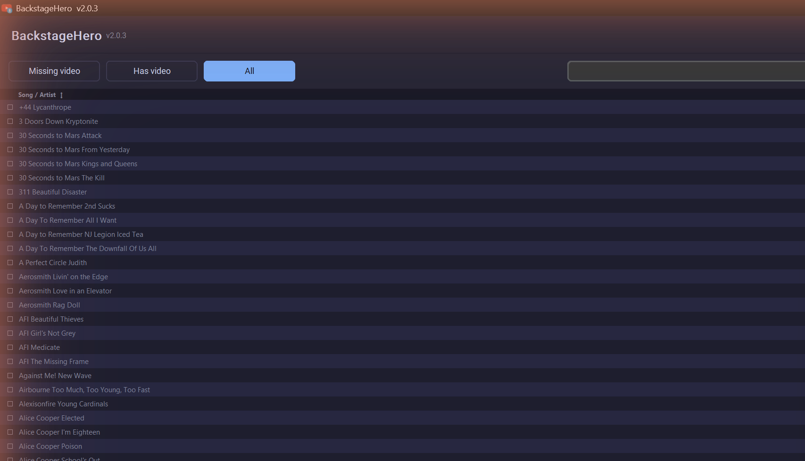

<p align="center">
  
</p>

<h1 align="center">BackstageHero + Library Hygiene</h1>

<p align="center">Downloads background videos for your Clone Hero songs, lines them up with the charts, and keeps the whole library clean.</p>

---



This is a fork of [jmb988/BackstageHero](https://github.com/jmb988/BackstageHero) (MIT licensed -- see **Credits**). BackstageHero's video download/matching/sync engine is unchanged; this fork adds four library-hygiene tools on top: repairing variable-frame-rate and unsupported-codec videos, fixing ID-suffixed chart filenames, filling in blank metadata, and finding duplicate charts.

If a song folder has a `video.mp4` in it, Clone Hero plays it behind the chart. Doing that by hand across a whole library takes forever. This searches YouTube for the ones that are missing it, fingerprints candidates against your chart's own audio to make sure it's really the right song, downloads a match, and lines the video up so it starts with the song.

Point it at your Songs folder and it fills in whatever doesn't have a video yet.

## Install

This fork runs from source only for now -- see **From source** below. (Upstream BackstageHero ships a packaged `.exe` with a self-updater; this fork hasn't set up its own release pipeline yet, so those parts of the original app are present in the code but dormant when run from source -- see **What's different in this fork**.)

Songs that already have a video are skipped, so re-running after you add charts is fine. You can close it mid-run; it cleans up the song it was on and picks up again next time.

## New in v2

- proper GUI instead of the old console prompts. you can see the whole library, filter by what's missing a video, and check resolutions
- it works out the timing itself now, by matching the video's audio against the chart audio instead of dropping the same offset on everything
- manual offset editor for the ones it gets wrong. right click a song, drag the slider, the preview follows. there's no cap on the offset -- the slider widens to whatever the chart needs, and you can type an exact value if dragging is fiddly
- right click → **Dump this video** when a download turns out to be the wrong song, a lyric video, or someone's bedroom cover. it deletes the file *and* remembers that particular upload, so the next run picks something else instead of fetching the same one again
- every library scan drops a `backstagehero_library.csv` next to your songs -- title, artist, whether it has a video, resolution, the offset and where the offset came from, and anything you've dumped. handy for finding the songs that were never really synced
- optional sharing: turn it on and once a few people land on the same offset for a chart, that becomes the default for anyone else who downloads it
- updates itself, and keeps yt-dlp updated too (it has to, YouTube breaks it every few weeks)

## Library Tools

Click **Library Tools** next to the folder picker for six whole-library scans, each with a **Dry run** toggle so you can preview before anything changes:

- **Repair videos** -- detects variable-frame-rate video (a single sync offset can't fix a *drift* that grows over the video, only the start point) and re-encodes it to constant frame rate. Also removes unsupported (non-VP8) WebM files left by other tools; the song then re-downloads on the next run.
- **Fix chart names** -- some chart sources leave numeric-ID-suffixed filenames (`song_2400.ini` instead of `song.ini`, `notes_454.chart` instead of `notes.chart`, and the same for audio stems and album art) that Clone Hero can't load at all. This verifies a suffixed file's actual content matches the folder before renaming it -- never a blind guess. Anything it can't confirm is moved intact to `_needs_review/` for you to sort out by hand.
- **Enrich metadata** -- looks up each song on [Chorus Encore](https://www.enchor.us/) and fills in **blank** `song.ini` fields (`year`/`genre`/`charter`/`album`) from a confident match. Never overwrites a field that already has a value.
- **Find duplicates** -- finds charts of the same song from different sources (fuzzy title/artist match, confirmed with audio fingerprinting so a live version or cover is never mistaken for a duplicate), scores each copy by chart/instrument completeness, and moves everything but the best-scoring keeper to `_duplicates_review/`. **Nothing is ever deleted** -- review that folder and delete by hand once you're satisfied. Needs `fpcalc` (see **From source**) to actually confirm and move anything; without it, this just reports how many candidate groups it found.
- **Find static album-art videos** -- detects videos that are just an album cover held on screen for the whole song (common on YouTube, costs tens of MB per song to download), converts them to album art, and removes the video file. Two independent checks have to agree before anything is deleted, and every error path leaves the video alone. Anything with visible motion -- a slow zoom, a visualizer, scrolling lyrics, a crawling progress bar, a locked-off performance -- is reported but never touched. The honest limit, measured rather than assumed: motion covering well under about 1% of the frame (a small logo bug, a tiny blinking dot) can still read as static and be converted. If you'd rather keep everything, leave this tool alone -- nothing else runs it.
- **Move old review folders out of the library** -- earlier versions put `_needs_review` *inside* your Songs folder. Clone Hero still loads songs from there and this app still downloads videos for them, but no repair scan can find them again. This moves any it finds to a folder alongside your library, where the rest of the tools already put them. Nothing is deleted, and a name that already exists on the other side is left where it is rather than overwritten.

`dedupe_report.py` also runs standalone from a terminal (`python dedupe_report.py --library-path <path> [--dry-run]`), if you'd rather script it than click through the GUI.

## How the timing works

Every music video has a different amount of intro before the song starts, so you can't use one offset for everything. Once it's picked a video it grabs the audio and matches it against the chart's stems to find where they line up. It compares the pattern of peaks rather than the raw audio, so a louder or differently mastered YouTube version still matches. If it's sure, it writes the offset into `video_start_time`. If it isn't (live version, remix, just the wrong video) it leaves the default and you fix that one by hand.

Official music videos usually just work. The ones that need a manual pass are custom charts with edited intros, replaced audio, or no audio in the chart to match against at all. Whatever you set in the editor can be shared too.

## Why it still works

Most YouTube downloaders use the web player API, which now wants bot-challenge tokens that rotate constantly. This goes through the TV embedded and Android client APIs instead, which don't need those tokens. It also keeps yt-dlp updated on its own, so when YouTube breaks something and yt-dlp patches it, the fix shows up within a day or so, no new release needed.

On a big run YouTube will start throttling. It paces itself to stay under that and eases off automatically when it gets pushback, so most runs just ride it out. A hard IP block is on YouTube's end and waiting it out is the only fix there, but nothing gets lost or redone when you come back to it, since anything that already has a video is skipped.

## From source

```
git clone https://github.com/coheniskool/BackstageHero_LibraryHygiene
cd BackstageHero_LibraryHygiene
pip install -r requirements.txt
python gui.py
```

Timing needs ffmpeg on your PATH or sitting in the project folder. Static Windows builds are at [BtbN/FFmpeg-Builds](https://github.com/BtbN/FFmpeg-Builds/releases).

Duplicate detection additionally needs `fpcalc` on PATH -- get it from the official [AcoustID/Chromaprint release](https://acoustid.org/chromaprint), not an arbitrary download (same trust bar as ffmpeg). Without it, **Find duplicates** still runs and reports candidate groups, but never confirms or moves anything.

To build the exe, run `python build.py`. It downloads ffmpeg and packs everything into `dist/`. (Untested on this fork -- the exe self-updater points at upstream's GitHub releases, which won't have this fork's changes; see below.)

## What's different in this fork

- **Six new library-hygiene tools** (above), reachable from the **Library Tools** button, plus the standalone `dedupe_report.py` CLI. All of them find songs the same way the downloader does -- recursively -- so a nested `Songs/<Pack>/<Song>/` library works, and a pack folder is never mistaken for a broken song.
- **The community resolver stays on**, same as upstream -- chart lookups skip the YouTube search for known charts, and confident matches are reported back to help others. The **Share matches** checkbox still controls just the outbound half.
- **The app self-updater is dormant from source** (it's `_frozen()`-gated in the original code too -- it only ever ran in the packaged exe). This fork doesn't have its own release pipeline yet, so there's no exe to update *to*. yt-dlp's separate PyPI auto-update channel is unaffected by this and still only matters for a packaged build.
- Nothing about the video search/matching/sync engine changed -- `audiosync.py` and `VideoDownload.py` are upstream's, with one addition: every downloaded video now also gets a VFR check (see **Repair videos** above) before it's considered done.

## Credits

Built on [jmb988/BackstageHero](https://github.com/jmb988/BackstageHero) (MIT license, see `LICENSE`) -- the video download, matching, and sync engine is entirely jmb988's work. ffmpeg ([BtbN builds](https://github.com/BtbN/FFmpeg-Builds), GPLv3), [yt-dlp](https://github.com/yt-dlp/yt-dlp), and [Chorus Encore](https://www.enchor.us/) (metadata lookups) do the rest of the real work.
